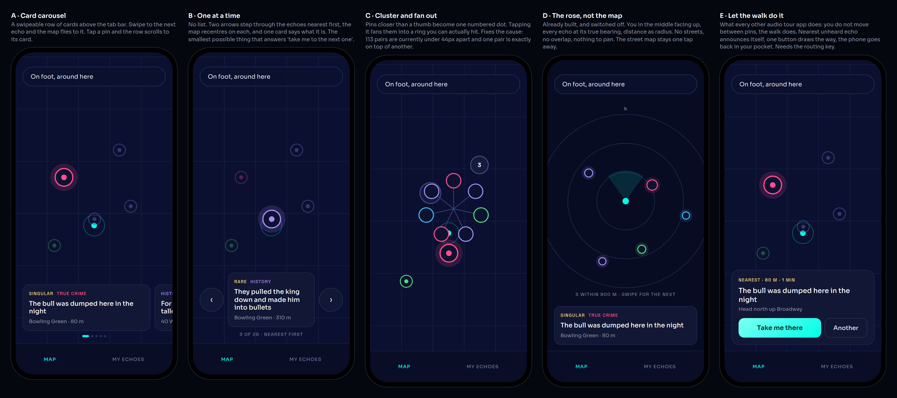
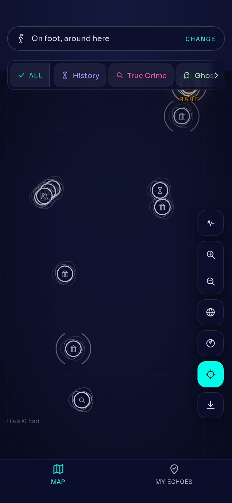
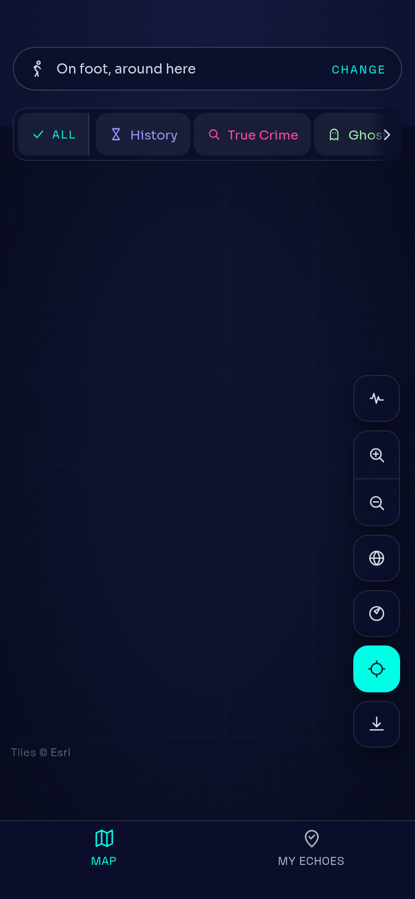

# Moving from echo to echo, on a phone

Options, not a decision. Nothing here is built yet.

## What is actually wrong, measured

Every number below came out of driving the real app in a real browser at a real phone
size and asking the page, rather than out of looking at a screenshot and forming an
opinion. That distinction matters here because the last three rounds of this were lost to
exactly that.

| | |
|---|---|
| Echoes on the Manhattan map | 26 |
| Pairs of pins closer together than a 44px thumb | **113** |
| Closest pair | **0px — two pins are drawn at the same point** |
| Pin core, at default zoom | 41px, under Apple's 44 |
| Echoes reachable from a list on that screen | **none. There is no sheet on it at all** |
| Pins left on screen after tapping zoom-in three times | **0 of 26** |
| At the full sheet detent on a 375x667 phone | the zoom buttons and all five fab buttons are off the bottom |

Two things are NOT wrong, and it is worth saying so because they are where you would
normally look first. **The gestures all work.** One finger pans, two fingers pinch, double
tap steps in, the wheel zooms, and each of those is implemented properly with a six pixel
slop threshold so a tap on a pin still lands. I checked by dragging and measuring where a
pin moved to: drag 96px right and 96px up, the pin moves 96px right and 96px up. And the
map is not missing a basemap in the way it looks — Esri tiles are wired up, this sandbox
just cannot fetch them, so every render I can take shows a bare field.

So the problem is not that you cannot move the map. **It is that there is no way to get
from one echo to the next except by aiming a thumb at a 41px target in a pile of 26, and
when you zoom in to make that easier, everything disappears.**

## What everyone else does

Worth knowing before choosing, because this category has converged. The audio tour apps —
[VoiceMap](https://voicemap.me/), [izi.TRAVEL](https://play.google.com/store/apps/details?id=travel.opas.client),
[GuideAlong](https://guidealong.com/) — mostly do not ask you to move between pins at all.
izi.TRAVEL calls it Free Walking Mode: GPS picks the nearest thing and plays it. GuideAlong
is hands free by design, phone in pocket. The map in those apps is something you check, not
something you operate.

The map-first apps that DO ask you to pick — Google Maps, Airbnb — all landed on the same
answer: a [non-modal bottom sheet](https://www.nngroup.com/articles/bottom-sheet/) or a card
carousel over the map, thumb height, where moving to the next result is a swipe rather than
a tap on a target. NN/g's argument for it is that it keeps you in place on the map instead of
making you give up your position to see a list.

And for the pile of pins specifically, the settled answer is cluster plus
[spiderfy](https://github.com/jawj/OverlappingMarkerSpiderfier): group what is close, and
when a group is tapped, fan the members out into a ring you can hit. Clustering alone does
not fix pins at identical coordinates, which this library has — you can zoom to the maximum
and they are still on top of each other.

## The options

### A. Card carousel under the map

A horizontally swipeable row of echo cards sitting above the tab bar, ordered by distance.
Swiping to the next card pans and zooms the map to that echo and lights its pin; tapping a
pin scrolls the row to its card. One thumb, no aiming.

- **For:** the pattern everybody already knows, so there is nothing to learn. Answers "take
  me to the next one" directly. The map stays visible and in context.
- **Against:** costs about 140px of map. Still a map-first model, so it does not help if the
  map itself is the wrong tool on foot. Does not fix the pin pile on its own.
- **Effort:** medium. The sheet already has rows and detents, and the map's zoom and pan are
  already controlled props on `RouteMap`, so flying to an echo is a state change we can
  already make.

### B. One at a time

No list. Two arrows step through the echoes nearest first, the map recentres on each, its
pin blooms and the others dim, and a single card names it. "3 of 26, nearest first" under it.

- **For:** the smallest interaction that solves the stated problem. Excellent while actually
  walking, with the phone at arm's length and one hand on a coffee. Zero aiming, and a
  44px+ target that never moves.
- **Against:** you lose the overview. Bad at "what is around me generally", which is half of
  what the map is for.
- **Effort:** small. A pure addition on top of controlled zoom and pan. This is the cheapest
  thing on the list by a distance.

### C. Cluster and fan out

Group pins closer than a thumb into one numbered dot. Tapping it fans the members into a
ring at hittable spacing, or zooms to fit them. Put the category colour back on each ring
and hold every pin at 44px minimum.

- **For:** fixes the cause rather than working around it, and 113 overlapping pairs is the
  cause. Makes every other option on this list better. Standard, well understood.
- **Against:** on its own it does not give you "move to the next one" — it makes the pins
  hittable, which is necessary and not sufficient. More map code to own.
- **Effort:** medium.

### D. The rose instead of the map

Already built, in `Rose.tsx`, and currently switched off — the default view was changed from
`rose` to `map`. You in the middle facing up, every echo at its true bearing with distance as
radius, category as colour. No streets, because the question on foot is "which way do I turn
my body", not "which way round the block". The street map stays one tap away.

- **For:** it exists. No pin overlap is possible. No basemap dependency, which matters given
  we cannot currently see the basemap render at all. It is the honest answer to what a
  walking screen is for, and it is the one option that is different rather than better.
- **Against:** unfamiliar. People expect a map and may read this as the app being broken.
  Loses street context for planning a loop.
- **Effort:** tiny to switch on, plus a polish pass and the swipe-for-next card under it.

### E. Let the walk do it

The category's own answer. You do not move between echoes; the walk does. The nearest unheard
echo announces itself, one button draws the way and gives turn by turn, and the phone goes
back in your pocket. The map becomes a thing you check.

- **For:** most true to the product. ADR-0010 already says arriving is the mechanic, and the
  proximity hum is already built. It is the best answer on a phone because it is the answer
  that does not need the phone.
- **Against:** "Take me to this one" currently draws no route and gives no directions, and
  that needs the Google Routes key which is not in the environment yet. So this one is
  partly blocked on something outside the code.
- **Effort:** large, and gated.

## What I would do

**C first, then B, then A.** C because 113 overlapping pairs is the actual defect and
everything else is built on top of it. B because it is a day's work and it answers the
literal complaint. A once the carousel has somewhere clean to fly to.

**D is worth switching on this week regardless**, as a second view behind the existing
toggle rather than as a replacement — it costs almost nothing, and it is the only option
here that can be judged by using it rather than by arguing about it.

**E is the destination** and should not be attempted until the routing key exists, because
half of it is the route drawing.

## The floor, whichever option wins

These are defects rather than choices, and they want fixing either way.

1. Pins pass under the category chip row and behind the fab column. They need the same inset
   the sheet gets.
2. At the full sheet detent on a 375x667 phone, the zoom buttons and every fab are below the
   glass. Measured, reported by `npm run audit:controls`.
3. Zooming in three times leaves an empty screen with no way to know which way anything is.
   It needs an edge marker, or "26 echoes off screen, tap to fit".
4. There is no list on the roam map at all, so there is currently nothing to step through
   even if you wanted to.
